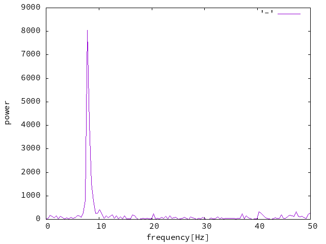
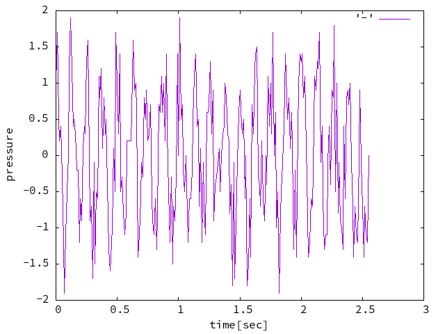

# Signal processing library

[](https://github.com/ecto0310/signal_processing_library/actions/workflows/ci.yml)

## Demo

You can basic processing on signals.

The image below shows the signal converted to spectrum.



<details>
<summary>signal graph</summary>


</details>

## Requirement

- gnuplot

## Usage

```bash
git clone https://github.com/ecto0310/signal_processing_library.git
cd signal_processing_library
cmake -B build
cmake --build build
./build/signal_processing_sample
```
